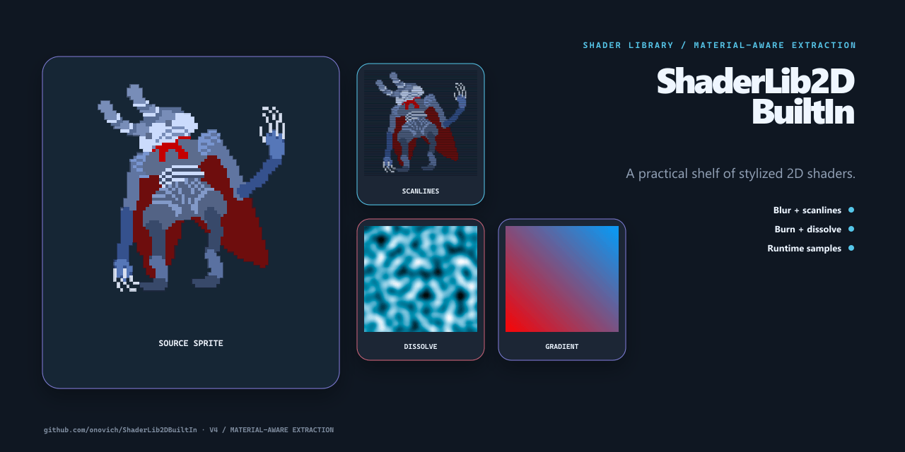

# ShaderLib2DBuiltIn

[English](README.md)

收集模糊、扫描线、燃烧、溶解、渐变、分形等 2D Shader 的 Unity 示例库。

## 项目包含什么

- 模糊与扫描线。
- 燃烧与溶解。
- 运行时示例。

## 快速开始

克隆仓库后，用 Unity Hub 将仓库根目录作为工程打开。

## 仓库结构

- `Assets/` — Unity 脚本、场景、包与项目资源。
- `Packages/` — Unity 包依赖。
- `ProjectSettings/` — Unity 工程配置。

## 当前状态

这是一个聚焦单一技术问题的示例仓库，重点是让实现和使用边界容易检查。当前仓库没有自动化测试，评估时请在目标环境中直接运行。

## 许可证

当前仓库未包含开源许可证。
